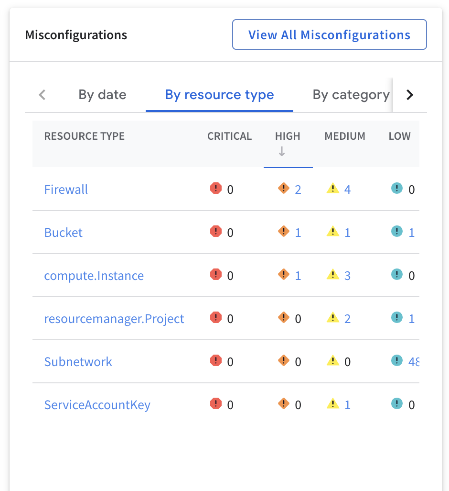
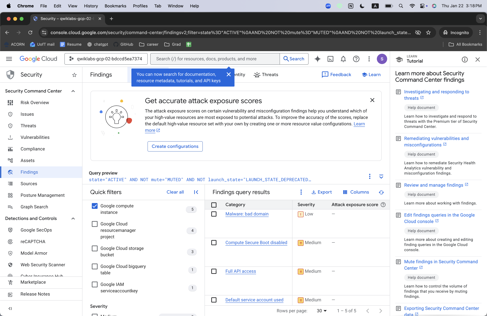
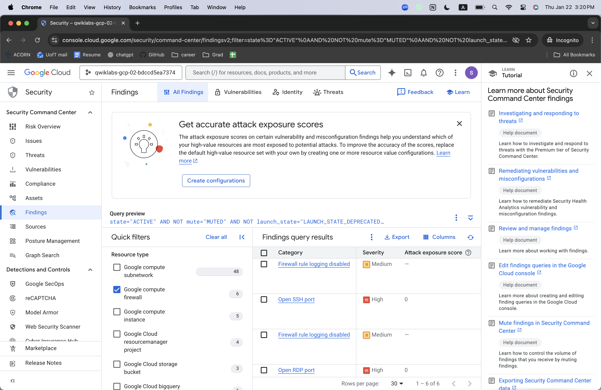
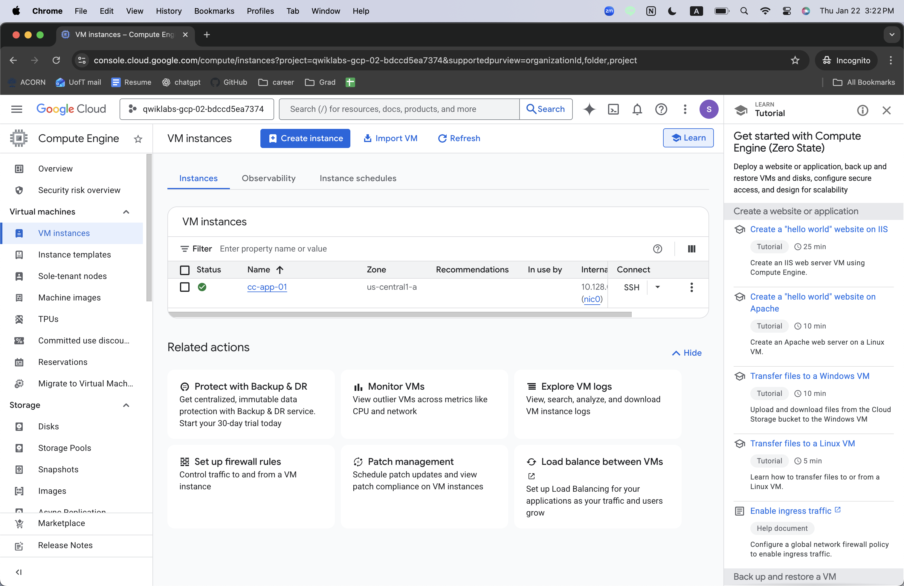
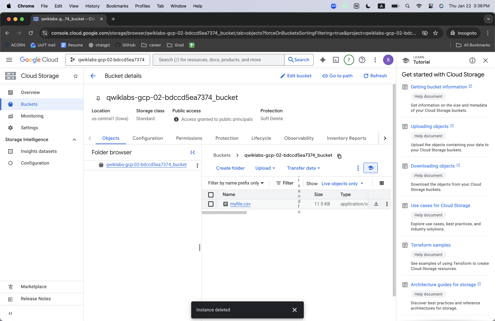
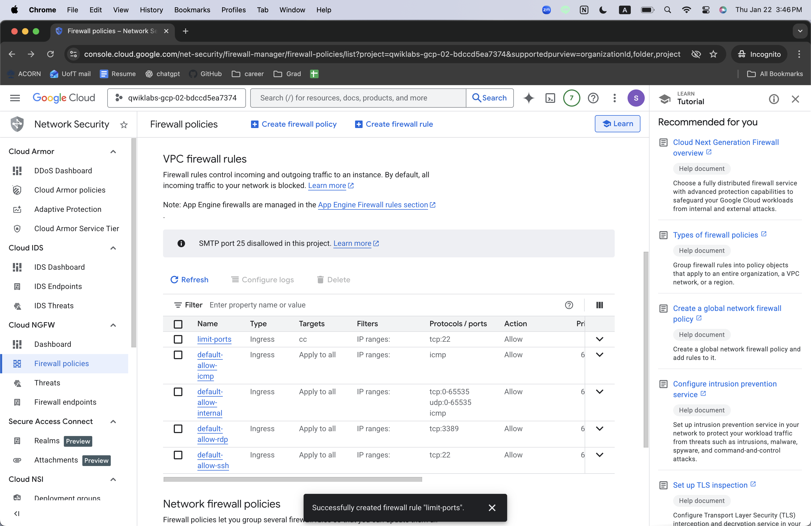

# Cloud Incident Response (GCP)

## Cloud Incident Response & Remediation (Google Cloud)

### Overview

This project documents a simulated cloud security incident involving a large-scale data breach affecting compute resources, network configurations, and cloud storage in a Google Cloud environment. Acting as a security analyst, I investigated active security findings, identified root causes of the breach, remediated critical misconfigurations, and verified compliance against PCI DSS requirements.

## Incident Summary

The organization experienced unauthorized access to sensitive customer data, including credit card and personal information. Security findings revealed multiple high-severity misconfigurations across cloud storage, virtual machines, service accounts, and firewall rules. These weaknesses collectively expanded the attack surface and enabled external access to critical systems.

## Investigation & Findings

Using Google Cloud Security Command Center, I analyzed active findings and compliance reports. Key high-severity issues included:

- Publicly accessible Cloud Storage bucket (public ACLs)

- Compute instances with public IP addresses

- SSH and RDP ports exposed to the internet

- Firewall rule logging disabled

- Default service account with overly broad API access

- Malware-related domain activity from a compromised VM

These findings indicated violations of least privilege, insufficient network segmentation, and lack of observability.

## Remediation Actions

1. Compute & Identity Hardening
     - Shut down and deleted the compromised VM
     - Recreated a clean VM from a trusted snapshot
     - Removed public IP assignment
     - Enabled Secure Boot
     - Replaced default service account usage with a restricted service account
     - Applied network tags to enforce targeted firewall rules
  

2. Cloud Storage Security
     - Revoked public access to the storage bucket
     - Migrated from fine-grained ACLs to uniform bucket-level access
     - Removed anonymous and public principals
     - Enforced centralized IAM-based access control
  

4. Network & Firewall Hardening
    - Removed overly permissive firewall rules allowing unrestricted ICMP, SSH, and RDP access
    - Created a restricted SSH firewall rule allowing access only via Google Cloud IAP
    - Enabled firewall rule logging for remaining rules to improve visibility and auditability
  

## Compliance Verification

After remediation, I re-ran the PCI DSS 3.2.1 compliance report. All high- and medium-severity findings related to the incident were resolved. Remaining low-severity findings (such as disabled VPC Flow Logs) were acknowledged as out of scope for this lab environment.

## Key Takeaways

- Cloud breaches often result from combined misconfigurations, not a single failure

- Public access controls and overly permissive defaults are common attack vectors

- Infrastructure hardening must be paired with logging and visibility

- Compliance frameworks like PCI DSS are valuable for prioritizing remediation efforts

- Incident response in cloud environments requires coordination across identity, compute, storage, and networking layers

## Skills Demonstrated

- Cloud incident response & triage

- Security Command Center analysis

- IAM and access control hardening

- Firewall design and attack surface reduction

- PCI DSS compliance validation

- Secure VM recovery using snapshots
